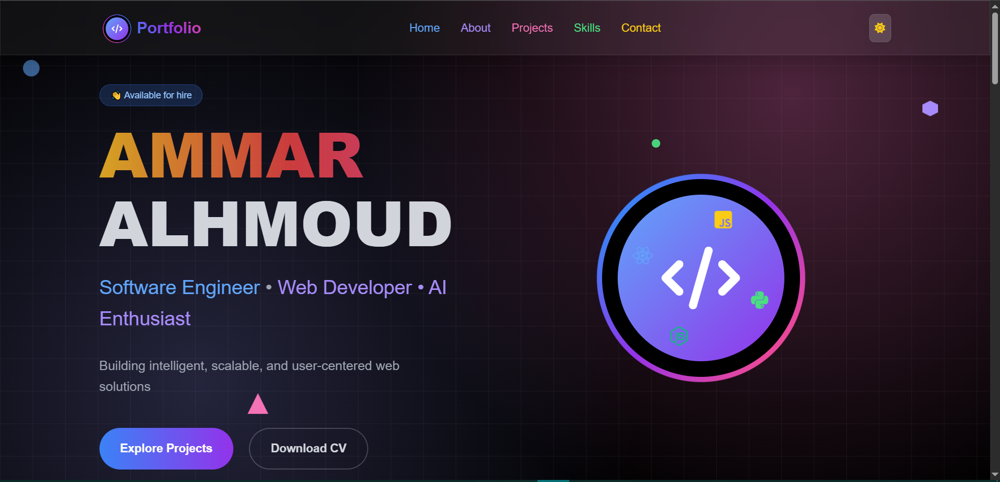
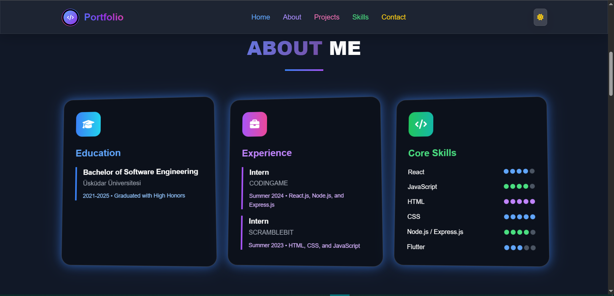
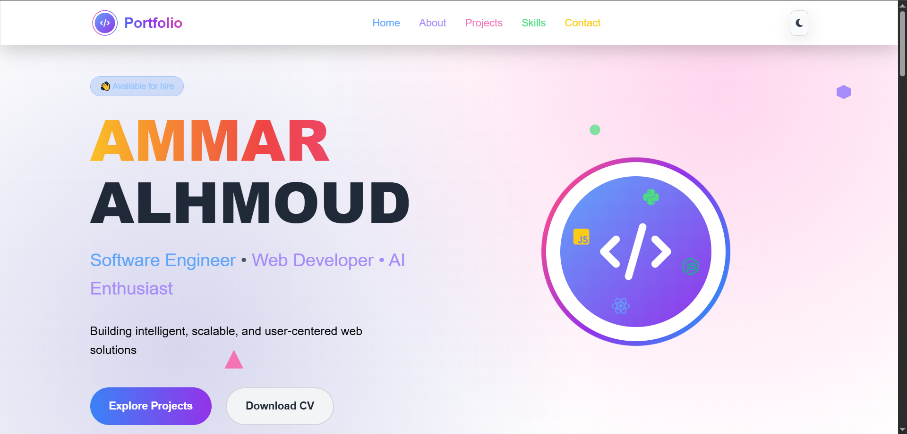
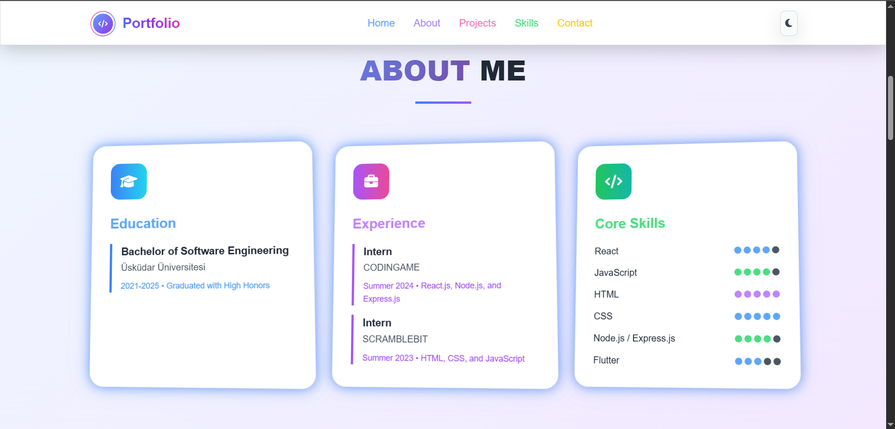

# 💼 Ammar Alhmoud – Portfolio Website

Welcome to my personal portfolio website!  
This is a modern, and responsive web application built to showcase my skills, projects, blogs, and professional journey as a **Software Engineering graduate** with a passion for **Web Development** and **Artificial Intelligence**.

## 🚀 Live Preview

🌐 [Visit the Portfolio](https://ammaralhmoud.netlify.app/)

---

## 📂 Features

- 🎯 **Modern UI/UX Design** (Dark/Light mode support)
- 🧑‍💻 **About Me** – Background, skills, education
- 🧰 **Tech Stack Section** – Technologies I use
- 🗂️ **Projects Gallery** – Highlights of real-world projects with links to GitHub and live demos
- 📫 **Contact Form** – Reach me directly via email
- 🌐 **Social Links** – GitHub, LinkedIn, Twitter, and more
- 📄 **Downloadable CV**

---

## 🛠️ Tech Stack

- **React.js**
- **CSS Modules**
- **JSON-based dynamic content**
- **Netlify** (for hosting)

---

## 📸 Screenshots

---

## 🎓 About Me

I’m **Ammar Alhmoud**, a recent graduate from **Üsküdar University** with a Bachelor's degree in Software Engineering. I specialize in front-end and full-stack development, and I'm passionate about crafting user-centric web apps and exploring AI applications.

---

## 📬 Contact

Feel free to connect with me on:

- GitHub: [github.com/AmmarAlhmoud](https://github.com/AmmarAlhmoud)
- LinkedIn: [linkedin.com/in/ammar-alhmoud-59b531336/](https://www.linkedin.com/in/ammar-alhmoud-59b531336/)
- Email: ammar.m.alhmoud@gmail.com

---

## 🧾 License

This project is open source and available under the [MIT License](LICENSE).

---

## 🙌 Acknowledgements

Thanks to all the tools and open-source libraries that make building amazing things easier every day.

---

⭐ If you like this project, feel free to star the repo or connect with me!
